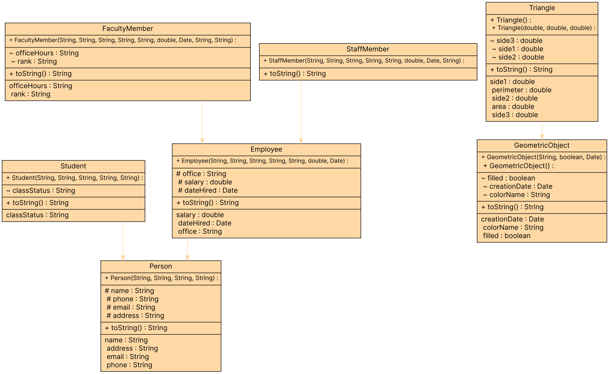

### Task 1:

--------
(The GeometricObject class) is a class that contains:

- 3 data members:
  - colorName
  - a boolean value that identifies if the shape is filled with a color or not
  - A Date object that will store the creation date of the object.
- An all-argument constructor
- Setters and getters for all data members.
- A toString method to print the object.
- Draw the UML diagram for the class.

(The Triangle class) Design a class named Triangle that extends GeometricObject. The class contains:

- Three double data fields named side1, side2, and side3 with default values 1.0 to denote three sides of a triangle.
- A no-argument constructor that creates a default triangle.
- A constructor that creates a triangle with the specified side1, side2, and side3.
- The accessor methods for all three data fields.
- A method named getArea() that returns the area of this triangle.
- A method named getPerimeter() that returns the perimeter of this triangle.
- A method named toString() that returns a string description for the triangle.
- For the formula to compute the area of a triangle from 3 sides, use this [link](https://ar.wikihow.com/%D8%AD%D8%B3%D8%A7%D8%A8-%D9%85%D8%B3%D8%A7%D8%AD%D8%A9-%D8%A7%D9%84%D9%85%D8%AB%D9%84%D8%AB#:~:text=2-,%D8%B7%D9%88%D9%84%20%D8%A7%D9%84%D8%B6%D9%84%D8%B9%D9%8A%D9%86,-1)
- The toString() method is implemented as follows:
  java
  return "Triangle: side1 = " + side1 + ", side2 = " + side2 + ", side3 = " + side3;

- Draw the UML diagrams for the classes Triangle and GeometricObject and implement the classes.
- Write a test program that prompts the user to enter three sides of the triangle, a color, and a Boolean value to indicate whether the triangle is filled. The program should create a Triangle object with these sides and set the color and filled properties using the input. The program should display the area, perimeter, color, and true or false to indicate whether it is filled or not.

### Task 2:

--------
(Person, Student, Employee, Faculty, and Staff classes) Design a class named Person and its two subclasses named Student and Employee. Make Faculty and Staff subclasses of Employee.

A person has:

- A name
- An address
- A phone number
- An e-mail address.

A student has:

- A class status (freshman, sophomore, junior, or senior). Define the status as a constant.

An employee has:

- An office
- A salary
- A date hired. Use the Date class.

A faculty member has:

- Office hours
- A rank.

A staff member has:

- A title.

Override the toString method in each class to display the class name and the person's name.

Draw the UML diagram for the classes and implement them. Write a test program that creates a Person, Student, Employee, Faculty, and Staff, and invokes their toString() methods.

  
### UML Diagram
